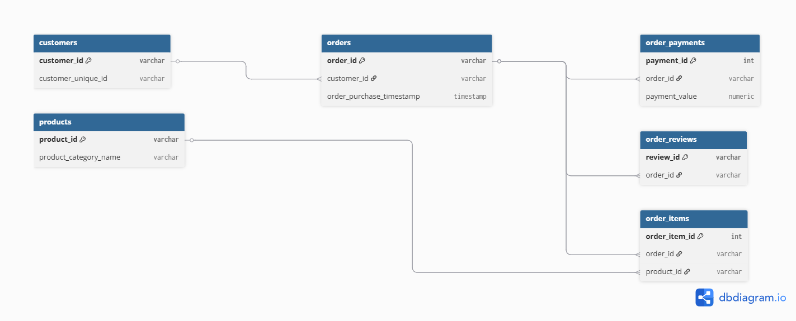

# 📊 E-commerce SQL Analytics Project (Olist Dataset)

## 📌 Overview
This project is a complete SQL-based data analysis of an e-commerce dataset (Olist).  
The goal is to extract meaningful business insights such as customer behavior, revenue trends, product performance, and customer segmentation.

The project simulates real-world data analytics tasks commonly performed by Data Analysts and Data Engineers.

---

## 🎯 Business Objectives
- Understand overall business performance (customers, orders, revenue)
- Analyze sales trends over time
- Identify top-performing customers and products
- Segment customers based on behavior
- Practice advanced SQL techniques (CTEs, Window Functions, Aggregations)

---

## 📁 Project Structure

SQL/
│
├── 01_schema.sql      # Database schema creation
├── 02_import.sql      # Data loading / import scripts
├── 03_analysis.sql    # All SQL analysis queries (KPIs + insights)
├── 04_insights.md     # Business insights/results summary
├── ERD.png            # Entity-Relationship Diagram (ERD)
├── readme.md          # Project documentation (this file)

---

## 🗺️ Entity-Relationship Diagram (ERD)

The following ERD shows the main tables in the Olist database and how they are connected (customers, orders, products, order_items, payments, reviews):

## 🧰 Tools & Technologies
- SQL (PostgreSQL)
- Window Functions
- CTEs (Common Table Expressions)
- Aggregations & Joins

---

## 📊 Key Analysis Performed

### 1. Business KPIs
- Total number of customers
- Total number of orders
- Total revenue

### 2. Revenue Analysis
- Monthly revenue trends
- Overall business performance snapshot

### 3. Customer Analysis
- Top customers by number of orders
- Average order value per customer
- Customer segmentation (New, Regular, Loyal)

### 4. Product Analysis
- Top-selling products
- Product category performance

### 5. Advanced Analysis
- Customer spending analysis using window functions
- Customer ranking based on total spending

---

## 📈 Key Insights (Sample)
- A small group of customers contributes a large portion of total revenue
- Most customers are one-time or low-frequency buyers
- Certain months show higher sales indicating seasonal trends
- A few product categories dominate total sales

---

## 🧠 Skills Demonstrated
- Data aggregation and summarization
- Complex SQL joins
- Window functions (RANK, SUM OVER)
- Data segmentation using CASE statements
- Business-oriented thinking

---

## 🚀 How to Use
1. Run `01_schema.sql` to create database structure
2. Run `02_import.sql` to load data
3. Run `03_analysis.sql` to execute all analysis queries

---

## 📌 Dataset
Olist E-commerce Dataset (Brazilian marketplace data)

---

## 👩‍💻 Author
Rowan Aymn
---

## ⭐ Future Improvements
- Add dashboard (Power BI / Tableau)
- Add cohort analysis
- Calculate Customer Lifetime Value (CLV)
- Build predictive sales trends
